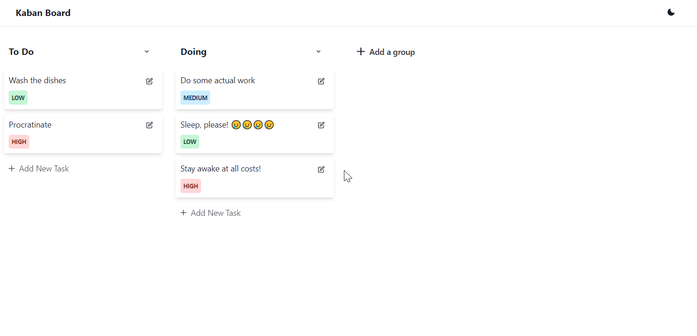

<h1 align="center">
  KanbanBoard
</h1>

<h3 align="center">
  A Kanban Board for project and task management
</h3>



<p align="center">
  

  <a href="https://www.linkedin.com/in/matheus-vicente-d-190001b2/" target="_blank" rel="noopener noreferrer">
    
  </a>

  <a href="https://github.com/chamatt/tasks-kaban-board/commits/master">
    
  </a>

  <a href="https://github.com/chamatt/tasks-kaban-board/issues">
    
  </a>

  
</p>


<p align="center">
  <a href="#%EF%B8%8F-about-the-project">About the project</a>&nbsp;&nbsp;&nbsp;|&nbsp;&nbsp;&nbsp;
  <a href="#-technologies">Technologies</a>&nbsp;&nbsp;&nbsp;|&nbsp;&nbsp;&nbsp;
  <a href="#-getting-started">Getting started</a>&nbsp;&nbsp;&nbsp;|&nbsp;&nbsp;&nbsp;
  <a href="#-license">License</a>
</p>

## 📔 About the project

A complete Kaban Board application. (Trello/Jira Clone)

#### Features:

[✔] Fully accessible with keyboard navigation and interaction

[✔] Add tasks to a board column

[✔] Remove tasks from board columns

[✔] Rename tasks

[✔] Move tasks to other board columns using drag and drop

[✔] Create new board columns (e.g.: Todo, Done, Doing, QA...)

[✔] Rename board columns

## 🚀 Technologies

Technologies that were used in this application

- [Node.js](https://nodejs.org/en/)
- [TypeScript](https://www.typescriptlang.org/) [The project it fully typed]
- [React](https://reactjs.org)
- [Easy-Peasy Redux](https://github.com/ctrlplusb/easy-peasy) [Cool Redux Abstraction]
- [React Beautiful DnD](https://github.com/atlassian/react-beautiful-dnd) [Drag-n-Drop Library]
- [Chakra-UI](https://chakra-ui.com/) [Tailwind-like style library]

## 💻 Getting started

### Test the live version

You can use the deployed application here: [KabanBoard](https://chamatt.github.io/KanbanBoard/)

### Or build it yourself

#### Requirements

- [Node.js](https://nodejs.org/en/)
- [Yarn](https://classic.yarnpkg.com/) or [npm](https://www.npmjs.com/)

**Clone the project and access the folder**

```bash
$ git clone https://github.com/chamatt/tasks-kaban-board.git && cd tasks-kaban-board
```

**Follow the steps below**

```bash
# Install the dependencies
$ yarn

# Run in dev mode
$ yarn start

# or generate a build
$ yarn build

# Well done, project is started!
```

## 📝 License

This project is licensed under the MIT License - see the [LICENSE](LICENSE) file for details.

---
